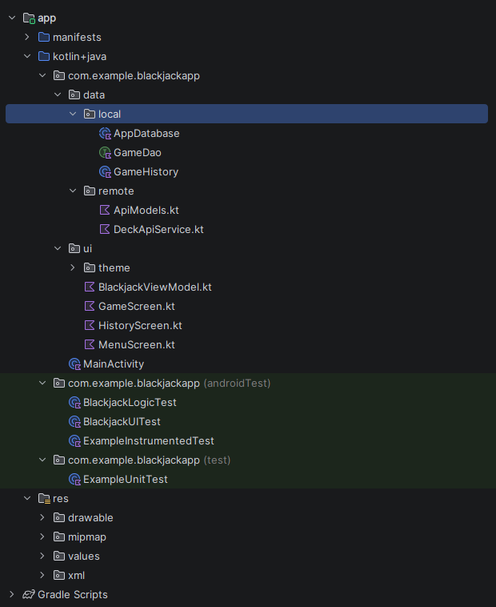

# Диаграмма файлов приложения

## Описание модулей
* **data/local** — классы для работы с базой данных (AppDatabase, GameDao).
* **data/remote** — классы для работы с сетью и API (DeckApiService).
* **ui/** — экраны приложения на Jetpack Compose (GameScreen, MenuScreen, etc.) и ViewModel для управления состояниями.