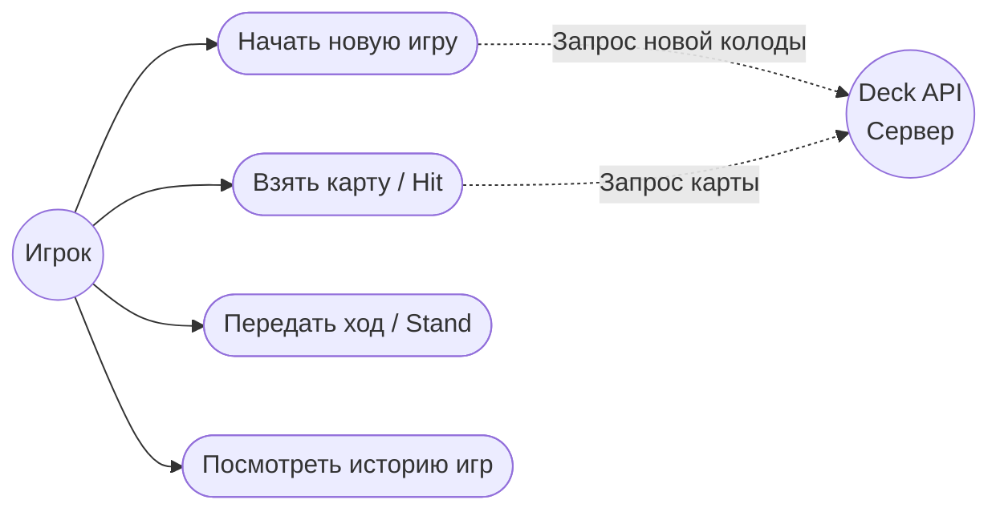

# Функциональные требования

## Описание
Приложение должно позволять пользователю запускать новую партию в Blackjack, получать карты (взаимодействие с внешним Deck API), подсчитывать очки по классическим правилам и сохранять результат партии в локальную базу данных.

## Текстовые сценарии
* **Сценарий 1: Начало игры.** Пользователь нажимает "Играть", система делает запрос к API, получает новую колоду и раздает по 2 карты игроку и дилеру.
* **Сценарий 2: Добор карты.** Пользователь нажимает "Взять карту". Система выдает 1 карту. Если сумма очков > 21, игра немедленно завершается поражением (Перебор).

## Диаграмма Use Case
