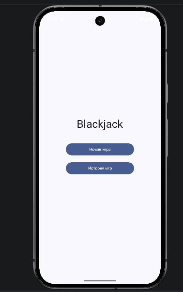
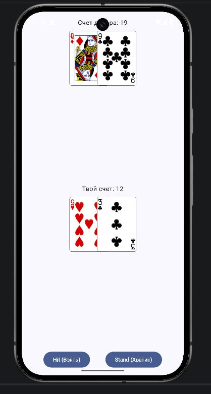
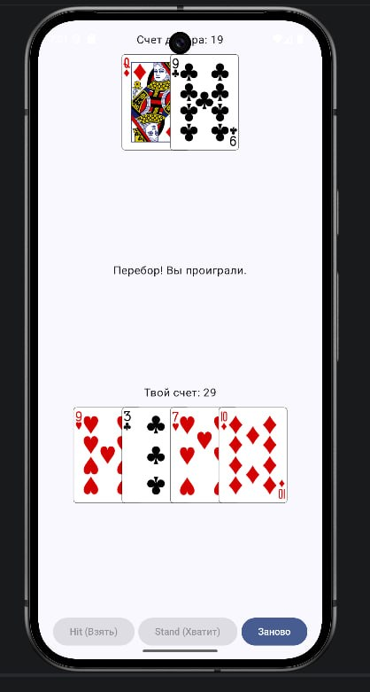
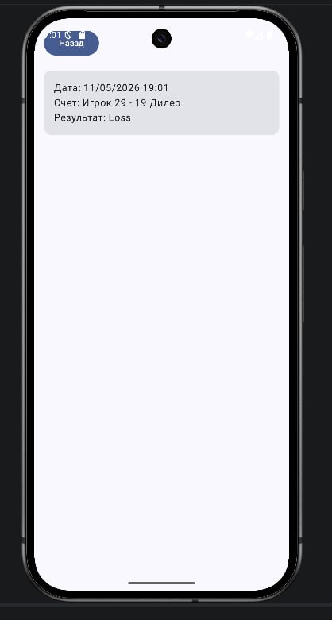

# Project Name: Blackjack Mobile

## Description
Мобильное приложение для игры в классический Blackjack (Двадцать одно). Игрок соревнуется с дилером, стараясь набрать количество очков, максимально близкое к 21, но не превышающее его. Приложение реализует многооконный интерфейс, сохраняет историю партий локально в базе данных и загружает игровые колоды через внешнее API. Разработано под ОС Android с использованием Jetpack Compose.

## Installation
Для того чтобы запустить проект локально, выполните следующие шаги:
1. Клонируйте репозиторий с кодом приложения (он прикреплен как submodule):
   `git clone --recurse-submodules https://github.com/BSUAndroidProjectTeam123/Wiki.git`
   *(или скачайте APK-файл из раздела GitHub Actions -> Artifacts)*.
2. Откройте проект в Android Studio (версии Flamingo или новее).
3. Дождитесь синхронизации Gradle.
4. Выберите устройство (эмулятор или физическое) и нажмите кнопку **Run** (Shift + F10).

## Usage
Приложение интуитивно понятно в использовании:
1. На главном экране выберите "Начать игру" или "История игр".
2. В режиме игры нажимайте кнопку **"Взять карту" (Hit)**, чтобы получить еще одну карту, или **"Хватит" (Stand)**, чтобы передать ход дилеру.
3. В конце раунда результат автоматически сохранится в историю.

## Contributing
Проект разработан командой в рамках дисциплины ПВМС.
* **[Шамына Алексей]** — Создание проекта и организации, настройка actions, документирование, подключение тестов.
* **[Харченко Анастасия]** — Проектирование и создание приложения, подключение и создание БД, подключение API, создание тестов.

[Презентация](https://drive.google.com/file/d/1yNPdJofmLaUNHTZRasr9kvdfQ8DaSinl/view?usp=sharing)
